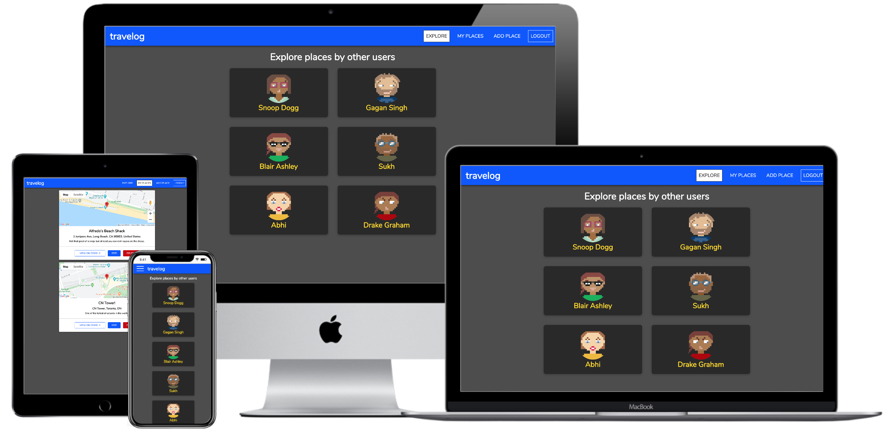
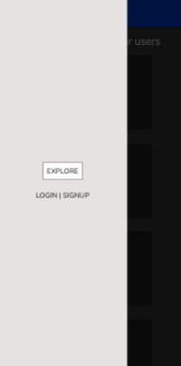
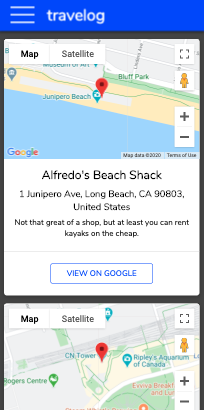
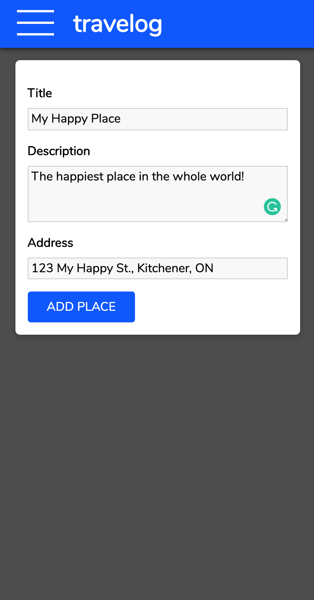
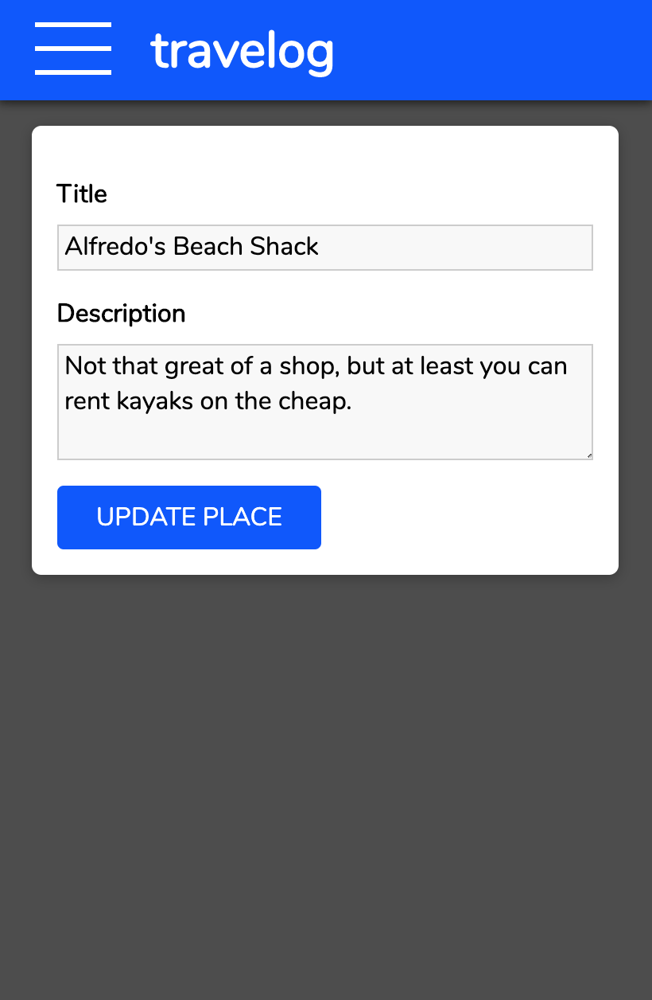

# babyaid

## Description

An app for travelers that allows them to log the places they visit and seem them on an embedded Google Maps view.

### Features

-   Users not logged in can explore places added by other users.
-   Users can signup, login and logout.
-   After logging in, a place of interest can be added by filling out a short form that requires the place's name, description and address.
-   The MY PLACES page displays a list of all places added by a user, along with a Google Map view.
-   EDIT button on MY PLACES page allows updating the names and descriptions of a previously added place, but only by the user that added it.
-   DELETE button on the MY PLACES page allows the deletetion of a place from the users profile, but only by the user that added it in the first place.
-   Clicking on VIEW ON GOOGLE button on the MY PLACES page opens a new google map window pointing to the place that was clicked.
-   If the place is well known (such as major landmarks, cities, government sites, etc.), only the name of the place followed by the city name is sufficient. E.g. CN Tower, Toronto is a valid address (instead of typing out the full street address).

### Authentication Features

-   Passwords are hashed and managed via JWT (jsonwebtokens).
-   Users are automatically logged out after 1 hour for added security.
-   A popup displays appropriate information if the email or password used during login are incorrect.
-   If signing up using a previously used email, an error popup is displayed.

## Live page:

https://travelog-app.now.sh

## Technical stack

### Front end built using

-   React (create-react-app)
-   React Router

### Back end built using

-   Nodejs
-   Express
-   Winston
-   Morgan
-   Helmet
-   Dotenv

## Database built & hosted using

-   PostgreSQL
-   Knex
-   Postgrator
-   Heroku

### External API

-   Google Geocoding API

### API testing done using

-   Chai
-   Mocha
-   Supertest

## Screenshots

## Github repos:

### Client:

https://github.com/gaganssingh/travelog-app

### API:

https://github.com/gaganssingh/travelog-server

## User Feedback:

First: https://gist.github.com/gaganssingh/b48438c975cef5b6ba7ffd9b125f1b75
Second: https://gist.github.com/gaganssingh/f0a4caa96cccc8a90d7321101e10743b
